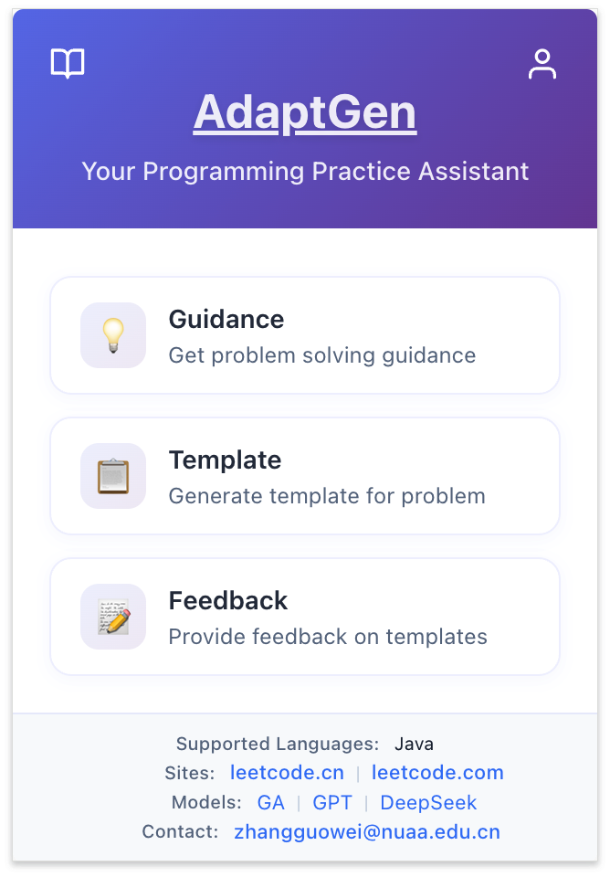

# AdaptGen 插件使用手册

## 1. 安装指南

[下载](https://github.com/excuse2020/AdaptGen-crx)：打开该网址，点击绿色 `Code`，选择 `Download ZIP`。解压文件，`chrome-adaptgen`为插件文件夹。

打开 Chrome 浏览器，点击右上角的图标，进入扩展程序管理界面。在弹出的菜单中点击“扩展程序”，选择“管理扩展程序”。

开启右上角的“开发者模式”，点击“加载已解压的扩展程序”，选择 `chrome-adaptgen` 文件夹。

确保插件已启用，并点击图钉按钮将 AdaptGen 固定在浏览器工具栏。

点击插件图标，弹出主界面，表示 AdaptGen 安装成功！

## 2. 使用指南

### 2.1 登录

1. 在插件主页的 `Sites` 页面中，快速跳转至 LeetCode 题库，或进入 [题库](https://zzzzzzgw.top/user-study) 选择题目跳转：

   - [leetcode.cn](https://leetcode.cn/)（中文网站，推荐）
   - [leetcode.com](https://leetcode.com/)（英文网站）
   - 登录或注册个人 LeetCode 账号，用于提交代码。

   

2. 注册 AdaptGen 插件用户信息以便收集反馈。点击右上角用户图标进入登录界面，新用户点击 `Register now` 进行注册，输入昵称和密码注册账号。

   >  [!IMPORTANT]
   >
   > 需要进入到 LeetCode 界面进行上面操作

   

3. 注册成功后将自动跳转至用户信息页面，**更新个人信息**。

   

### 2.2 使用插件辅助编程

#### 2.2.1 模板生成

在题目描述界面点击插件主界面中的 `Template` 或通过右键菜单选择 `生成模板`。

模板生成设置说明：

- **Template Type（模板类型）**：
  - Full：将代码中重要的逻辑判断和赋值运算使用占位符替换，需自主实现关键逻辑。
  - Data Structures：在Full的基础上保留基本的数据定义，提示你可以使用何种数据结构解决问题，具体的算法流程需自主实现。
  - Algorithms：仅在Full的基础上保留控制流程，提示解决问题的一般流程，你需要思考选择何种数据结构存储数据，并完成具体的算法流程。
  - Original：原始模板，未经任何处理，不可直接用于提交。 
- **Language**：目前仅支持 Java。
- **Model**：包含基于 GA（遗传算法）、GA-OPT（优化版本，优化了标识符不一致的问题，优先选择）、GPT、DeepSeek、Qwen、Doubao、Gemini、Claude 生成的代码模板，选择 All 则显示所有方法生成的模板。
- **Example Count**：从若干个AC代码中提取模板，Example Count为使用至少 N 个代码提取出的模板。Examples 越多，生成的模板通用性越强。
- **TopK**：查看评分最高的 K 个模板。

点击`Generate Template`生成并查看模板，可复制模块或全文。

> 插件将记录模板生成选项与复制行为（仅限模板部分），用于效果评估。

#### 2.2.2 提交信息收集

当检测到代码提交后，将弹出对话框询问提交结果（成功/失败，图 1），查看历史提交时也会提示。点击空白处可跳过。

可以根据提示上传每次提交的代码，用来分析模板是否有助于提高代码质量。

具体步骤：

1. 选择图 2 中的 `Yes`，复制提交记录中的代码（图3）
2. 等待弹出 Enter Code 界面（图 4），粘贴刚刚复制的代码，点击 `Submit` 按钮

#### 2.2.3 反馈信息收集

提交成功后将提示是否立即反馈，选择 `Yes` 立即跳转到反馈界面，选择 `No`可稍后通过主页的 `Feedback` 完成。

#### 模板反馈系统介绍

###### 模板正确性评估

1. **逻辑准确性评分：**模板是否准确反映了解决问题的逻辑框架/流程？

   - 5分：模板完全符合解决问题的逻辑框架/流程
   - 4分：模板较好地反映了解决问题的逻辑框架/流程，有小缺陷，**如缺少关键逻辑、含有多余代码、逻辑处理流程有误等**
   - 3分：模板基本反映了解决问题的逻辑框架/流程，存在部分缺陷
   - 2分：模板在逻辑框架上存在较大缺陷
   - 1分：模板完全不符合解决问题的逻辑框架/流程

2. **代码错误评分：**模板是否存在代码结构/语法错误？

   - 5分：模板代码完全没有错误
   - 4分：模板代码有极少量的小错误，不影响理解，可能存在的错误如下图
   - 3分：模板代码有一些小错误，但核心功能正确，稍做修改即可
   - 2分：模板代码有较多错误，影响理解，要做一些修改
   - 1分：模板代码存在多个严重错误，严重影响理解，需做大量修改

   **可能的错误类型：**

   - 结构错误：如缩进错误、括号不匹配
   - 代码语句顺序错误：如在变量定义前使用变量
   - 变量名问题：如无意义的变量命名、使用未定义的变量
   - 函数名问题：如无意义的函数命名、函数定义与使用不一致
   - 其他问题：请在文本框中描述

###### 模板有用性评估

3. **学习价值评分**：模板是否帮助你学习解决此类问题的思路和方法？

   - 5分：对学习解决此类问题的思路和方法非常有帮助
   - 4分：对学习解决此类问题有较好帮助
   - 3分：有一定帮助，但不显著
   - 2分：帮助有限
   - 1分：没有帮助

4. **效率评分**：模板是否能够提高你的解题效率？

   - 5分：极大提高了解题效率
   - 4分：有明显提高解题效率
   - 3分：对效率影响不大
   - 2分：稍微降低了解题效率
   - 1分：严重降低了解题效率

   **提高效率的可能原因：**

   - 提供了好的代码起点
   - 让用户专注于核心解题逻辑
   - 启发/强化了解题思路
   - 其他（请说明）

   **降低效率的可能原因：**

   - 模板质量不高（如逻辑不对、代码错误）
   - 与用户原本的解题逻辑不一致
   - 不是用户习惯的编码风格
   - 其他（请说明）

5. **代码风格评分**：模板体现的编码风格是否值得学习？

   - 5分：代码风格非常值得学习
   - 4分：代码风格值得学习
   - 3分：代码风格一般
   - 2分：代码风格较差
   - 1分：代码风格不值得学习

6. **综合评价**

   - 5分：模板非常有用，显著提升解题体验
   - 4分：模板有用，提升了解题体验
   - 3分：模板一般，对解题有一定帮助
   - 2分：模板作用有限，对解题帮助不大
   - 1分：模板几乎没什么作用

###### 补充反馈

7. **额外建议（选填）**
   - 请在此处提供任何关于模板的额外反馈、建议或具体改进意见
   - 可以分享模板如何改进才能更好地帮助解决问题
   - 也可以提出对模板系统的建议

## 3. 其他功能

### 通过大模型获取解题思路

准备工作：点击插件主页底下 `Models` 中大模型的 `api-key` 的配置（保存到本地浏览器），建议选择 DeepSeek。

使用：在题目描述界面点击插件主界面中的 `Guidance` 或通过右键菜单选择 `获取解题思路` 。选择使用的模型和要生成指导的编程语言，点击 `Get Guidance` ，获取到大模型的返回结果后会在新标签页中显示。

